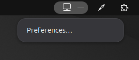
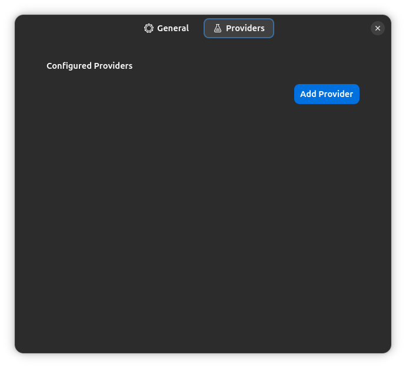
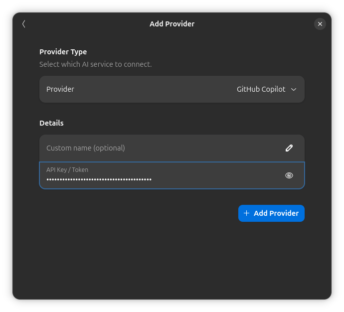
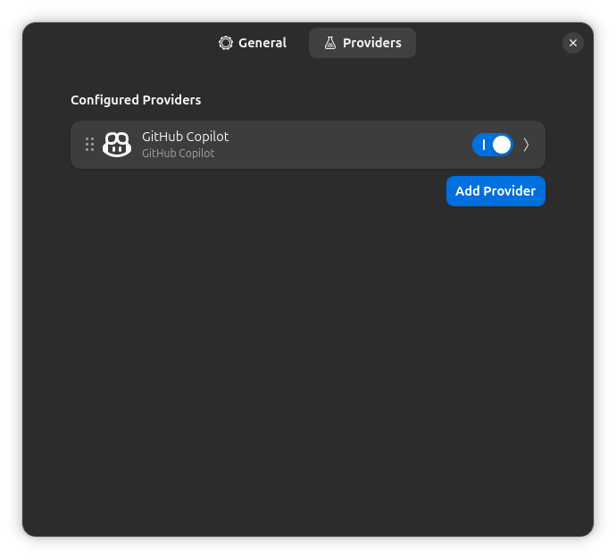

# AI Usage Tracker GNOME Extension

Tracks your AI usage limits across various providers.

> [!warning]
> This extension is unstable and subject to change. The installed extension will not automatically update if new updates are released.

## Installation

### Install from GitHub releases

1. Go to the [Releases page](https://github.com/ashuntu/gnome-ai-tracker/releases)
2. Find the latest release and download the corresponding `gnome-ai-tracker.zip` file
3. Run
   ```sh
   gnome-extensions install --force gnome-ai-tracker.zip
   ```

### Install from GitHub CI

1. Go to the [Actions](https://github.com/ashuntu/gnome-ai-tracker/actions) tab
2. Click the latest workflow run on `main`
3. Download the `gnome-ai-tracker` artifact
4. Run:
   ```sh
   gnome-extensions install --force gnome-ai-tracker.zip
   ```

Log out and back in, then enable the extension:

```sh
gnome-extensions enable gnome-ai-tracker@ashuntu.github.io
```

### Build and Install from Source

```sh
git clone https://github.com/ashuntu/gnome-ai-tracker.git
cd gnome-ai-tracker
make install
```

Log out and back in, then enable the extension:

```sh
gnome-extensions enable gnome-ai-tracker@ashuntu.github.io
```

## Usage

### Example: Adding Copilot

1. Click the extension icon and choose "Preferences..."



2. Navigate to the Providers tab and click Add Provider



3. [Generate a GitHub token](https://github.com/settings/tokens) (classic, no permissions needed) and add it to the Token field



4. GitHub Copilot is now being tracked!



5. See GitHub Copilot usage in top bar


## Contributing

See [CONTRIBUTING.md](./CONTRIBUTING.md)
